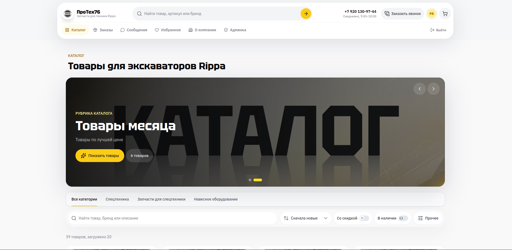
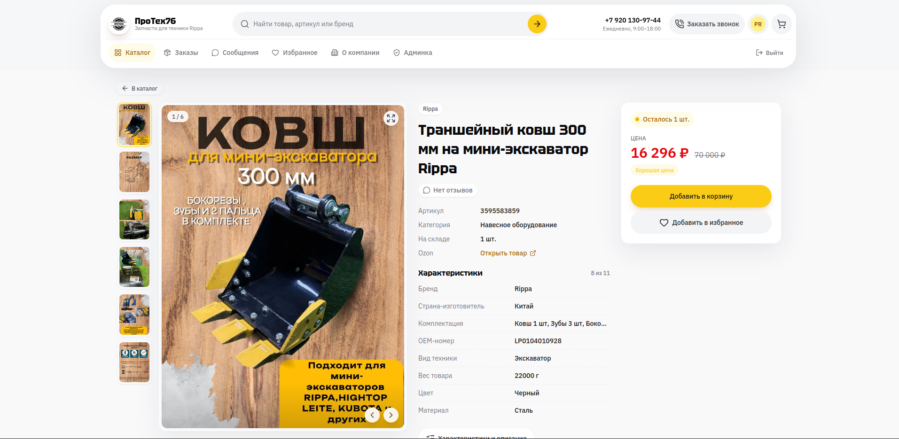
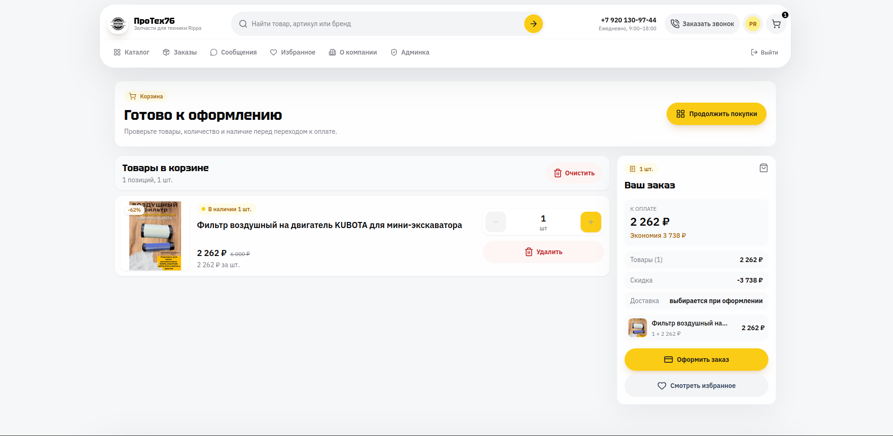
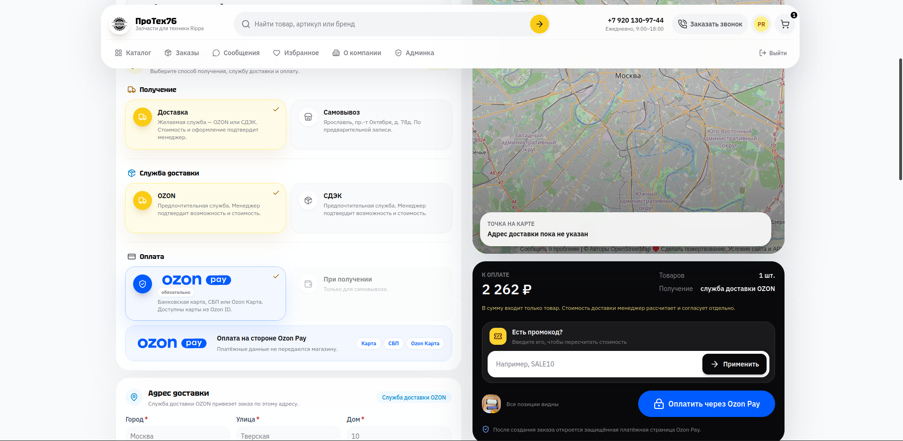
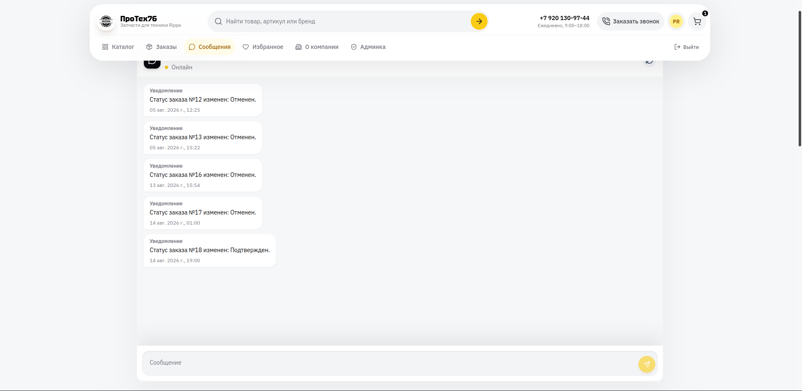
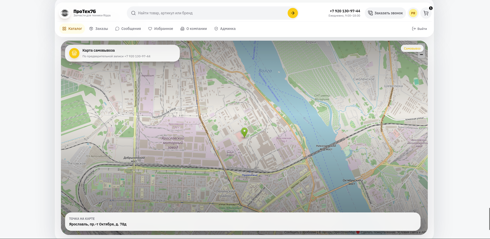
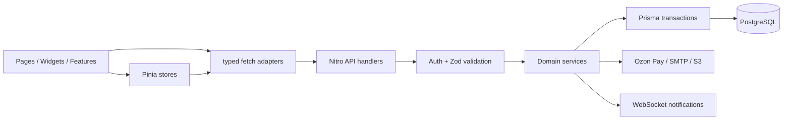

<p align="center">
  
</p>

<h1 align="center">ПроТех76</h1>

<p align="center">
  Production-ready интернет-магазин и операционная панель для каталога запчастей и навесного оборудования Rippa.
</p>

## Интерфейс

<table>
  <tr>
    <td width="50%" align="center">
      
      <br><sub><strong>Каталог и промо-рубрики</strong></sub>
    </td>
    <td width="50%" align="center">
      
      <br><sub><strong>Карточка товара</strong></sub>
    </td>
  </tr>
  <tr>
    <td width="50%" align="center">
      
      <br><sub><strong>Корзина</strong></sub>
    </td>
    <td width="50%" align="center">
      
      <br><sub><strong>Страница заказа</strong></sub>
    </td>
  </tr>
  <tr>
    <td width="50%" align="center">
      
      <br><sub><strong>Сообщения</strong></sub>
    </td>
    <td width="50%" align="center">
      
      <br><sub><strong>Карта точки самовывоза</strong></sub>
    </td>
  </tr>
</table>

Проект объединяет публичную SSR-витрину, личный кабинет покупателя, real-time сообщения и административный back office. Заказы создаются идемпотентно, остатки резервируются транзакционно, платежи синхронизируются через подписанные webhook’и, а API использует общие Zod-схемы и повторную серверную авторизацию.

## Возможности

- Каталог с поиском, сортировкой, категориями, рубриками, ценовыми и атрибутными фильтрами.
- Карточка товара: галерея, характеристики, история цены, отзывы и остаток.
- Авторизация по email, корзина, избранное, промокоды и история заказов.
- Доставка OZON/СДЭК, самовывоз и карта OpenStreetMap.
- Ozon Pay Checkout; поддержка legacy-синхронизации платежей YooKassa.
- Диалог покупателя с магазином через WebSocket и счётчик непрочитанных сообщений.
- Админ-панель: каталог, рубрики, склад, заказы, отзывы, пользователи, обращения и аналитика.
- S3-совместимые загрузки изображений, XLSX-отчёты, sitemap, Open Graph и Schema.org.
- Аудит административных действий, rate limiting и автоматическое освобождение резерва неоплаченных заказов.

## Технологии

| Область         | Решение                                                             |
| --------------- | ------------------------------------------------------------------- |
| Full stack      | Nuxt 4, Vue 3, TypeScript, Nitro                                    |
| UI              | Nuxt UI, Tailwind CSS 4, Lucide, Auto Animate                       |
| Состояние       | Pinia + persisted state только для безопасных клиентских черновиков |
| API и валидация | Nitro handlers, H3, Zod 4                                           |
| Данные          | PostgreSQL, Prisma 7, `@prisma/adapter-pg`                          |
| Авторизация     | Better Auth, email OTP, cookie sessions                             |
| Интеграции      | Ozon Pay, YooKassa legacy, Yandex SMTP, S3, OpenStreetMap           |
| Качество        | ESLint, `vue-tsc`, Vitest, GitHub Actions                           |
| SEO             | `@nuxtjs/seo`, sitemap, robots, Schema.org, OG Image                |

## Архитектура



### Фронтенд

Клиентская часть следует практическому варианту Feature-Sliced Design:

```text
app/
├── shared/       # UI-примитивы, форматтеры, fetch-адаптеры, общие типы
├── entities/     # карточки и представление Product / Order
├── features/     # законченные пользовательские сценарии
├── widgets/      # крупные композиционные блоки страниц и layout
├── stores/       # состояние сессии, корзины, фильтров и realtime
├── pages/        # маршруты и orchestration верхнего уровня
└── layouts/      # публичная и административная оболочки
```

Правило зависимостей: верхние слои могут собирать нижние, но `shared` ничего не знает о бизнес-сценариях, `entities` не импортируют `features`, а переиспользуемая логика не остаётся внутри страниц. Страницы отвечают за загрузку и координацию; визуальные секции оформляются компонентами с типизированными props/events.

### Бэкенд

```text
server/
├── api/public/   # публичные и пользовательские HTTP endpoints
├── api/admin/    # endpoints с обязательным requireAdmin
├── api/messages/ # WebSocket upgrade и подключение к topic
├── middleware/   # сквозной rate limiting
├── plugins/      # фоновые задачи Nitro
├── utils/        # auth, платежи, склад, DTO, аудит, интеграции
└── prisma/
    ├── models/   # schema, разбитая по доменам
    └── migrations/

shared/
├── config/       # единая конфигурация бренда и pure security policy
└── schemas/      # Zod-контракты, доступные клиенту и серверу
```

HTTP handlers выполняют четыре шага: авторизация, валидация контракта, вызов доменной логики и формирование безопасного DTO. Денежные расчёты выполняются через `Prisma.Decimal`; критичные изменения заказа, оплаты и склада — внутри транзакций.

## Быстрый старт

### Требования

- Node.js `>=22.12 <25` — рекомендуемая версия зафиксирована в `.nvmrc`.
- npm `>=10`.
- PostgreSQL.
- SMTP-аккаунт для полноценного сценария регистрации по email.
- S3-совместимое хранилище и токен Ozon Pay для соответствующих production-сценариев.

```bash
nvm use
cp .env.example .env
# Проверьте и при необходимости измените значения в .env.
npm ci
npm run prisma:migrate:deploy
npm run seed:admin
npm run dev
```

Приложение будет доступно по адресу `http://localhost:3000`, административный вход — `/admin/login`.

> `seed:admin` использует `ADMIN_EMAIL`, `ADMIN_PASSWORD` и `ADMIN_NAME`. Не запускайте seed с демонстрационным паролем и не храните реальные секреты в Git.

## Конфигурация окружения

Полный документированный шаблон находится в [`.env.example`](./.env.example). Основные группы:

| Группа           | Переменные                                                     | Назначение                                 |
| ---------------- | -------------------------------------------------------------- | ------------------------------------------ |
| Database         | `DATABASE_URL` или `DB_*`, `DATABASE_POOL_*`                   | PostgreSQL и параметры пула                |
| Auth             | `BETTER_AUTH_SECRET`, `BETTER_AUTH_URL`                        | подпись сессий и origin авторизации        |
| Public URL / SEO | `NUXT_SITE_URL`, `NUXT_PUBLIC_APP_URL`, `NUXT_OG_IMAGE_SECRET` | canonical URL, callback URL и OG image     |
| Admin seed       | `ADMIN_EMAIL`, `ADMIN_PASSWORD`, `ADMIN_NAME`                  | создание первого администратора            |
| Ozon Pay         | `OZON_PAY_*`                                                   | Checkout, webhook signature, VAT и timeout |
| YooKassa legacy  | `YOOKASSA_*`                                                   | синхронизация ранее созданных платежей     |
| Email            | `YANDEX_SMTP_*`                                                | OTP и verification email                   |
| Object storage   | `AWS_*`, `S3_*`                                                | загрузка и удаление изображений            |
| Protection       | `RATE_LIMIT_*`                                                 | лимиты auth/upload/cart/order/callback     |
| Order expiry     | `ORDER_EXPIRY_*`                                               | TTL неоплаченного заказа и фоновый job     |

Для production сгенерируйте независимые длинные секреты, например:

```bash
openssl rand -base64 48
```

`BETTER_AUTH_URL`, `NUXT_SITE_URL` и `NUXT_PUBLIC_APP_URL` должны указывать на один доверенный HTTPS-origin. Если приложение работает за reverse proxy, включайте `RATE_LIMIT_TRUST_PROXY=true` только когда proxy очищает и формирует `X-Forwarded-For` самостоятельно.

## Команды

| Команда                         | Что делает                                        |
| ------------------------------- | ------------------------------------------------- |
| `npm run dev`                   | запускает Nuxt dev server                         |
| `npm run build`                 | собирает production Nitro server                  |
| `npm run start`                 | запускает `.output/server/index.mjs`              |
| `npm run typecheck`             | проверяет типы Nuxt/Vue/TypeScript                |
| `npm run lint`                  | генерирует Nuxt types и запускает ESLint          |
| `npm test`                      | запускает весь набор Vitest один раз              |
| `npm run test:watch`            | запускает Vitest в watch-режиме                   |
| `npm run check`                 | Prisma validate/generate + typecheck + lint       |
| `npm run check:ci`              | полный gate: check + tests + production build     |
| `npm run prisma:migrate:deploy` | применяет только существующие миграции            |
| `npm run seed:admin`            | создаёт или обновляет настроенного администратора |

Перед pull request и деплоем достаточно выполнить:

```bash
npm run check:ci
```

Тот же gate автоматически запускается в GitHub Actions для push в `main` и для pull request.

## Данные и миграции

Prisma schema разделена по доменам в `server/prisma/models`. Изменения структуры БД всегда поставляются миграцией:

```bash
# локально, при разработке новой схемы
npx prisma migrate dev --schema ./server/prisma --name meaningful_change

# на staging/production
npm run prisma:migrate:deploy
```

Не используйте `prisma db push` как production-процедуру. Перед выкладкой сделайте backup и проверьте миграцию на копии production-данных. `seed:admin` запускается отдельно и только когда действительно требуется создать или обновить учётную запись.

## API conventions

- `server/api/public` означает доступность маршрута, а не отсутствие авторизации: пользовательские операции вызывают `requireUser`.
- Каждый `server/api/admin` handler вызывает `requireAdmin`; роль повторно читается из БД, поэтому устаревшая сессия не даёт административный доступ.
- Body валидируется через `validateBody` и `z.strictObject`; неизвестные поля отклоняются.
- Router/query IDs проходят централизованные bounded parsers из `server/utils/params.ts`.
- Клиент использует `shopFetch` и `adminFetch`, которые корректно прокидывают session cookie при SSR.
- Ошибки внешних платёжных API не возвращают их response body клиенту и не пишут чувствительные payload’ы в лог.
- Создание заказа требует `Idempotency-Key`; повтор с тем же телом возвращает ранее созданный заказ.

## Security baseline

- Cookie session, email verification и CSRF/origin checks Better Auth в production.
- Content Security Policy с явными `default-src`, `frame-src`, `connect-src`, запретом встраивания и отдельным dev-режимом.
- HSTS только в production; `nosniff`, `DENY`, строгий referrer policy и ограниченный Permissions Policy.
- Подписанные webhook’и и константное сравнение payment signatures.
- Транзакционная state machine платежей/заказов и защита от двойного списания остатков.
- Rate limiting для auth, upload, корзины, заказов и обратного звонка.
- Изображения ограничены 5 МБ, allowlist MIME дополняется проверкой сигнатуры файла.
- Секреты читаются только на сервере; `.env*` игнорируются, кроме безопасного `.env.example`.
- Приватные страницы отключены от SSR-кэша и поисковой индексации; API отвечает с `no-store`.

На reverse proxy дополнительно задайте лимит тела запроса немного выше 5 МБ, TLS, request timeout и ограничение частоты на сетевом уровне. Регулярно запускайте dependency audit в вашем CI/хостинге и обновляйте lockfile отдельным reviewable pull request.

## Наблюдаемость и health checks

| Endpoint                | Назначение                        | Ожидаемый ответ     |
| ----------------------- | --------------------------------- | ------------------- |
| `GET /api/health`       | liveness процесса                 | `200`, `status: ok` |
| `GET /api/health/ready` | readiness приложения и PostgreSQL | `200` или `503`     |

Логи не должны содержать cookie, authorization headers, OTP, email целиком или body платёжного провайдера. Для production рекомендуется подключить централизованный structured logger, error tracking и метрики p95 latency, 5xx, payment failures, pool saturation и длительности фонового job.

## Production deployment

```bash
npm ci
npm run check:ci
npm run prisma:migrate:deploy
node .output/server/index.mjs
```

Минимальный release checklist:

- Все URL используют реальный HTTPS-домен, а auth/payment callback’и проверены на staging.
- `BETTER_AUTH_SECRET`, `NUXT_OG_IMAGE_SECRET`, SMTP, S3 и payment secrets заданы через secret manager.
- В Ozon Acquiring настроен `/api/public/payments/ozon/webhook`, корректный VAT и режим фискализации.
- Бакет не разрешает произвольную запись, CORS и public read ограничены ожидаемым сценарием.
- Миграции применены до переключения трафика; backup и rollback-процедура проверены.
- Liveness/readiness подключены к платформе, алерты и retention логов настроены.
- Выполнен smoke test: регистрация → товар → корзина → промокод → заказ → оплата → webhook → сообщение.

## Масштабирование

Текущая реализация оптимальна для одного Nitro-инстанса или sticky deployment:

- WebSocket topics хранятся в памяти процесса. Для нескольких инстансов используйте Redis Pub/Sub или отдельный realtime gateway.
- Rate-limit buckets должны быть подключены к общему Nitro storage (например Redis), иначе лимит считается отдельно на каждом инстансе.
- Job истечения заказов транзакционно защищён от повторной обработки, но в multi-instance окружении лучше запускать его одним scheduler/worker; на web-инстансах установить `ORDER_EXPIRY_JOB_DISABLED=true`.
- S3 уже является внешним shared storage; локальный `public/uploads` подходит только для демонстрационных ассетов.

## Как безопасно расширять проект

1. Сначала добавьте или измените Zod-контракт в `shared/schemas`.
2. Доменную логику разместите в `server/utils` и покройте тестом без HTTP-обвязки.
3. Оставьте API handler тонким: access check → validation → service → DTO.
4. На фронтенде поместите самостоятельный сценарий в `features`, представление сущности — в `entities`, композиционный блок — в `widgets`.
5. Не храните server response или чувствительные данные в persisted Pinia state.
6. Для денег используйте decimal/integer minor units, не арифметику `number`.
7. Завершите изменение командой `npm run check:ci`.

Крупные admin-экраны уже разделяют визуальные секции на компоненты. Если orchestration конкретной страницы продолжит расти, следующий безопасный шаг — вынести её загрузку, фильтры и mutations в feature-level composable, сохранив page-файл как composition root.

## Лицензия

[Apache License 2.0](./LICENSE).
